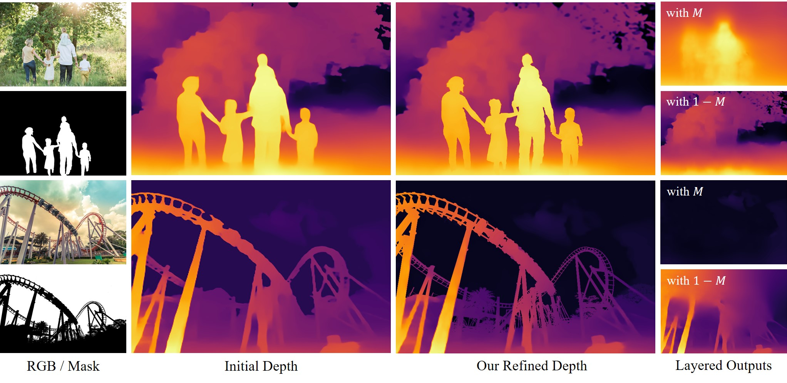

# Layered Depth Refinement with Mask Guidance
### CVPR 2022

| [Soo Ye Kim](https://sites.google.com/view/sooyekim) | [Jianming Zhang](https://jimmie33.github.io/) | [Simon Niklaus](https://sniklaus.com/welcome) | Yifei Fan |
|:---:|:---:|:---:|:---:|
| KAIST | Adobe | Adobe | Adobe |

| Simon Chen | [Zhe Lin](https://sites.google.com/site/zhelin625/) | [Munchurl Kim](https://www.viclab.kaist.ac.kr/) |
|:---:|:---:|:---:|
| Adobe | Adobe | KAIST |

  
    <a href="https://arxiv.org/abs/2206.03048"
       class="external-link button is-normal is-rounded is-dark">
      
          <i class="fas fa-file-pdf"></i>
      
      Paper
    </a>
  

Our layered depth refinement result on an initial prediction by <a href="https://github.com/isl-org/DPT">DPT</a>. Aided by a high-quality mask <i>M</i>, automatically generated using a <a href="https://www.remove.bg">commercial tool</a>, our method is able to accurately refine mask boundaries and correct depth values in isolated background regions. Regions in <i>M</i> and <i>1-M</i> are refined and inpainted/outpainted separately with our layered approach.

 

## Abstract

Depth maps are used in a wide range of applications from 3D rendering to 2D image effects such as Bokeh. However, those predicted by single image depth estimation (SIDE) models often fail to capture isolated holes in objects and/or have inaccurate boundary regions. Meanwhile, high-quality masks are much easier to obtain, using commercial auto-masking tools or off-the-shelf methods of segmentation and matting or even by manual editing. Hence, in this paper, we formulate a novel problem of mask-guided depth map refinement that utilizes a generic mask to refine the depth prediction of SIDE models. Our framework performs layered refinement and inpainting/outpainting, decomposing the depth map into two separate layers signified by the mask and the inverse mask. As datasets with both depth and mask annotations are scarce, we propose a self-supervised learning scheme that uses arbitrary masks and RGB-D datasets. We empirically show that our method is robust to different types of masks and initial depth predictions, accurately refining depth values in inner and outer mask boundary regions. We further analyze our model with an ablation study and demonstrate results on real applications.

## Demo

<b>Select an image from the left</b> and <b>hover over the buttons on the right</b> to compare the initial depth map by DPT [1] and the refined results by Boosting [2] and Ours. All images are from <a href="https://unsplash.com/">unsplash</a>, <a href="https://pixabay.com/">pixabay</a> and <a href="https://stock.adobe.com/">Adobe Stock</a>.  

